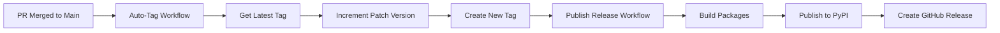

# Versioning Migration Plan: From VERSION File to Git Tags

## Overview

This document outlines the migration from a static `VERSION` file to dynamic git tag-based versioning with automated PyPI publishing via GitHub Actions.

## Current State

- **Version Source**: Single `VERSION` file at repository root containing `0.1.0`
- **Version Management**: Manual updates to VERSION file
- **Package Versioning**: 
  - Root package: Hardcoded in `pyproject.toml`
  - Core package: Uses `[tool.hatch.version]` pointing to `../../VERSION`
  - Docling-serve package: Uses `[tool.hatch.version]` pointing to `../../VERSION`
  - Local package: Hardcoded version `0.1.0`
- **Publishing**: Manual via Makefile or semi-automated via GitHub Actions on main branch push

## Target State

### Versioning Strategy

1. **Primary Source**: Git tags in format `v{MAJOR}.{MINOR}.{PATCH}` (e.g., `v0.1.0`, `v1.2.3`)
2. **Fallback for Local Development**: `0.0.0.dev0+g{git_hash}` when no tags exist
3. **Version Synchronization**: All packages (core, docling_serve, local) share the same version from git tags
4. **Tool**: Use `hatch-vcs` plugin for automatic version detection from git

### Automated Release Workflow



**Workflow Steps:**
1. Developer merges PR to `main` branch
2. `auto-tag.yml` workflow automatically increments patch version
3. Creates and pushes new version tag (e.g., v0.1.0 → v0.1.1)
4. Tag creation triggers `publish-release.yml` workflow
5. Packages are built, published to PyPI, and GitHub Release is created

**Version Increment Strategy:**
- **Automatic**: Always increment patch version on merge to main (safest approach)
- **Manual**: For major/minor bumps, manually create tag before merging

## Implementation Steps

### 1. Update Build System Dependencies

Add `hatch-vcs` to build requirements in all `pyproject.toml` files:

```toml
[build-system]
requires = ["hatchling>=1.24", "hatch-vcs>=0.3.0"]
build-backend = "hatchling.build"
```

### 2. Configure Dynamic Versioning

#### Root `pyproject.toml`
```toml
[project]
name = "paperless-docling-parser"
dynamic = ["version"]
# ... rest of config

[tool.hatch.version]
source = "vcs"
fallback-version = "0.0.0.dev0"

[tool.hatch.build.hooks.vcs]
version-file = "src/paperless_ngx_docling/_version.py"
```

#### `packages/core/pyproject.toml`
```toml
[project]
name = "pgx-docling-parser-core"
dynamic = ["version"]
# ... rest of config

[tool.hatch.version]
source = "vcs"
fallback-version = "0.0.0.dev0"

[tool.hatch.build.targets.sdist]
include = ["src/"]  # Remove ../../VERSION reference
```

#### `packages/docling_serve/pyproject.toml`
```toml
[project]
name = "pgx-docling-parser-serve"
dynamic = ["version"]
# ... rest of config

[tool.hatch.version]
source = "vcs"
fallback-version = "0.0.0.dev0"

[tool.hatch.build.targets.sdist]
include = ["src/"]  # Remove ../../VERSION reference
```

#### `packages/local/pyproject.toml`
```toml
[project]
name = "pgx-docling-parser-local"
dynamic = ["version"]  # Change from hardcoded version
# ... rest of config

[tool.hatch.version]
source = "vcs"
fallback-version = "0.0.0.dev0"
```

### 3. Update Package Dependencies

Since all packages will share the same version, update dependency constraints:

#### Root `pyproject.toml`
```toml
[project.optional-dependencies]
local = [
    "pgx-docling-parser-local",  # Remove version pin
]
docling-serve = [
    "pgx-docling-parser-serve",  # Remove version pin
]
```

#### `packages/docling_serve/pyproject.toml`
```toml
dependencies = [
    "pgx-docling-parser-core",  # Remove version constraint
    "httpx>=0.27.0",
    "tenacity>=8.2.0",
]
```

#### `packages/local/pyproject.toml`
```toml
dependencies = [
    "pgx-docling-parser-core",  # Remove version pin
]
```

### 4. Create GitHub Actions Workflow: `auto-tag.yml`

New workflow to automatically create tags on main merge:

```yaml
name: Auto Tag on Main Merge

on:
  push:
    branches:
      - main

jobs:
  auto-tag:
    name: Auto-increment patch version
    runs-on: ubuntu-latest
    permissions:
      contents: write
    
    steps:
      - name: Checkout code
        uses: actions/checkout@v4
        with:
          fetch-depth: 0  # Full history needed for version calculation
          token: ${{ secrets.GITHUB_TOKEN }}
      
      - name: Get latest tag
        id: get_latest_tag
        run: |
          # Get the latest tag, or use v0.0.0 if no tags exist
          LATEST_TAG=$(git describe --tags --abbrev=0 2>/dev/null || echo "v0.0.0")
          echo "latest_tag=$LATEST_TAG" >> $GITHUB_OUTPUT
          echo "Latest tag: $LATEST_TAG"
      
      - name: Calculate new version (patch increment)
        id: new_version
        run: |
          LATEST_TAG="${{ steps.get_latest_tag.outputs.latest_tag }}"
          
          # Remove 'v' prefix and split version
          VERSION=${LATEST_TAG#v}
          IFS='.' read -r MAJOR MINOR PATCH <<< "$VERSION"
          
          # Always increment patch version
          PATCH=$((PATCH + 1))
          
          NEW_VERSION="v${MAJOR}.${MINOR}.${PATCH}"
          echo "new_version=$NEW_VERSION" >> $GITHUB_OUTPUT
          echo "New version: $NEW_VERSION (patch increment from $LATEST_TAG)"
      
      - name: Check if tag already exists
        id: check_tag
        run: |
          NEW_VERSION="${{ steps.new_version.outputs.new_version }}"
          if git rev-parse "$NEW_VERSION" >/dev/null 2>&1; then
            echo "exists=true" >> $GITHUB_OUTPUT
            echo "Tag $NEW_VERSION already exists"
          else
            echo "exists=false" >> $GITHUB_OUTPUT
            echo "Tag $NEW_VERSION does not exist"
          fi
      
      - name: Create and push tag
        if: steps.check_tag.outputs.exists == 'false'
        run: |
          NEW_VERSION="${{ steps.new_version.outputs.new_version }}"
          
          git config user.name "github-actions[bot]"
          git config user.email "github-actions[bot]@users.noreply.github.com"
          
          git tag -a "$NEW_VERSION" -m "Automated patch version bump to $NEW_VERSION"
          git push origin "$NEW_VERSION"
          
          echo "✅ Created and pushed tag: $NEW_VERSION"
      
      - name: Skip tagging
        if: steps.check_tag.outputs.exists == 'true'
        run: |
          echo "⏭️  Skipping tag creation - tag already exists"
```

### 5. Create GitHub Actions Workflow: `publish-release.yml`

New workflow triggered on tag creation:

```yaml
name: Publish Release

on:
  push:
    tags:
      - 'v*.*.*'

jobs:
  build-and-publish:
    name: Build and Publish to PyPI
    runs-on: ubuntu-latest
    environment:
      name: production
      url: https://pypi.org/project/pgx-docling-parser-serve/
    permissions:
      contents: write  # For creating GitHub releases
      id-token: write  # For trusted publishing to PyPI (optional)
    
    steps:
      - name: Checkout code
        uses: actions/checkout@v4
        with:
          fetch-depth: 0  # Full history for version detection
      
      - name: Install uv
        uses: astral-sh/setup-uv@v3
        with:
          enable-cache: true
      
      - name: Set up Python
        uses: actions/setup-python@v5
        with:
          python-version: '3.12'
      
      - name: Verify tag version
        run: |
          TAG_VERSION=${GITHUB_REF#refs/tags/v}
          echo "Tag version: $TAG_VERSION"
          echo "TAG_VERSION=$TAG_VERSION" >> $GITHUB_ENV
      
      - name: Build core package
        run: |
          cd packages/core
          uv build
      
      - name: Build docling-serve package
        run: |
          cd packages/docling_serve
          uv build
      
      - name: Build local package
        run: |
          cd packages/local
          uv build
      
      - name: Publish core package to PyPI
        env:
          UV_PUBLISH_TOKEN: ${{ secrets.PYPI_TOKEN }}
        run: |
          cd packages/core
          uv publish
      
      - name: Publish docling-serve package to PyPI
        env:
          UV_PUBLISH_TOKEN: ${{ secrets.PYPI_TOKEN }}
        run: |
          cd packages/docling_serve
          uv publish
      
      - name: Publish local package to PyPI
        env:
          UV_PUBLISH_TOKEN: ${{ secrets.PYPI_TOKEN }}
        run: |
          cd packages/local
          uv publish
      
      - name: Create GitHub Release
        uses: softprops/action-gh-release@v1
        with:
          files: |
            packages/core/dist/*
            packages/docling_serve/dist/*
            packages/local/dist/*
          generate_release_notes: true
          draft: false
          prerelease: false
```

### 6. Update `build-and-publish.yml` → `build.yml`

Rename and simplify to only build (no publishing):

```yaml
name: Build Packages

on:
  push:
    branches:
      - main
      - dev
  pull_request:
    branches:
      - main
      - dev
  workflow_dispatch:

jobs:
  build:
    name: Build packages
    runs-on: ubuntu-latest
    
    steps:
      - name: Checkout code
        uses: actions/checkout@v4
        with:
          fetch-depth: 0  # Full history for version detection
      
      - name: Install uv
        uses: astral-sh/setup-uv@v3
        with:
          enable-cache: true
      
      - name: Set up Python
        uses: actions/setup-python@v5
        with:
          python-version: '3.12'
      
      - name: Build core package
        run: |
          cd packages/core
          uv build
      
      - name: Build docling-serve package
        run: |
          cd packages/docling_serve
          uv build
      
      - name: Build local package
        run: |
          cd packages/local
          uv build
      
      - name: Upload build artifacts
        uses: actions/upload-artifact@v4
        with:
          name: dist-packages
          path: |
            packages/core/dist/*
            packages/docling_serve/dist/*
            packages/local/dist/*
          retention-days: 7
```

### 7. Update Makefile

Update to document new release process:

```makefile
.PHONY: build-core build-docling-serve build-local build-all clean help

# Build targets
build-core:
	@echo "Building core package..."
	cd packages/core && uv build

build-docling-serve:
	@echo "Building docling-serve package..."
	cd packages/docling_serve && uv build

build-local:
	@echo "Building local package..."
	cd packages/local && uv build

build-all: build-core build-docling-serve build-local
	@echo "All packages built successfully!"

# Clean build artifacts
clean:
	@echo "Cleaning build artifacts..."
	rm -rf packages/core/dist packages/core/build packages/core/*.egg-info
	rm -rf packages/docling_serve/dist packages/docling_serve/build packages/docling_serve/*.egg-info
	rm -rf packages/local/dist packages/local/build packages/local/*.egg-info
	rm -rf dist build *.egg-info
	@echo "Clean completed!"

# Help target
help:
	@echo "Available targets:"
	@echo ""
	@echo "Build targets:"
	@echo "  build-core              - Build the core package"
	@echo "  build-docling-serve     - Build the docling-serve package"
	@echo "  build-local             - Build the local package"
	@echo "  build-all               - Build all packages"
	@echo ""
	@echo "Utility targets:"
	@echo "  clean                   - Remove all build artifacts"
	@echo "  help                    - Show this help message"
	@echo ""
	@echo "Automated Release Process:"
	@echo "  1. Merge PR to main branch"
	@echo "  2. GitHub Actions automatically:"
	@echo "     - Increments patch version (e.g., v0.1.0 → v0.1.1)"
	@echo "     - Creates and pushes version tag"
	@echo "     - Builds and publishes packages to PyPI"
	@echo "     - Creates GitHub Release with artifacts"
	@echo ""
	@echo "Manual Release (for major/minor bumps):"
	@echo "  git tag v0.2.0 && git push origin v0.2.0"
	@echo "  (This will trigger the publish workflow)"
```

### 8. Update AGENTS.md

Add section on versioning and release process:

```markdown
## Versioning and Release Process

### Version Management
- Versions are determined by git tags in format `v{MAJOR}.{MINOR}.{PATCH}`
- All packages (core, docling_serve, local) share the same version
- Local development without tags uses `0.0.0.dev0+g{git_hash}` format
- Version detection uses `hatch-vcs` plugin

### Automated Release Workflow
1. Developer merges PR to `main` branch
2. `auto-tag.yml` automatically increments patch version and creates tag
3. Tag creation triggers `publish-release.yml`
4. Packages are built, published to PyPI, and GitHub Release is created

### Version Increment Strategy
- **Automatic**: Patch version incremented on every main merge (v0.1.0 → v0.1.1)
- **Manual**: For major/minor bumps, create tag manually before merging:
  ```bash
  git tag v0.2.0  # Minor bump
  git tag v1.0.0  # Major bump
  git push origin <tag>
  ```

### Local Development
- No manual version updates needed
- Build commands work without tags (uses fallback version)
- Version is automatically detected from git history
```

### 9. Update CONTRIBUTING.md

Add release process documentation:

```markdown
## Release Process

This project uses **automated releases** triggered by merging to the `main` branch.

### Automated Patch Releases

Every merge to `main` automatically:
1. Increments the patch version (e.g., v0.1.0 → v0.1.1)
2. Creates and pushes a new git tag
3. Builds all packages
4. Publishes to PyPI
5. Creates a GitHub Release with artifacts

**You don't need to do anything special** - just merge your PR to main!

### Manual Major/Minor Releases

For breaking changes or new features that warrant a major or minor version bump:

1. **Before merging to main**, create the appropriate tag:
   ```bash
   # For minor version bump (new features)
   git tag v0.2.0
   git push origin v0.2.0
   
   # For major version bump (breaking changes)
   git tag v1.0.0
   git push origin v1.0.0
   ```

2. Then merge your PR to main
3. The auto-tag workflow will see the tag already exists and skip automatic tagging
4. The publish workflow will trigger from your manual tag

### Version Numbering

Follow [Semantic Versioning](https://semver.org/):
- **MAJOR** (v1.0.0): Incompatible API changes
- **MINOR** (v0.2.0): New functionality (backwards compatible)
- **PATCH** (v0.1.1): Bug fixes (backwards compatible)

### Workflow Summary

```
Normal PR merge → Auto patch bump → v0.1.0 → v0.1.1
Feature release → Manual tag v0.2.0 → Merge PR → Publish v0.2.0
Breaking change → Manual tag v1.0.0 → Merge PR → Publish v1.0.0
```

### Local Development Versions

When working locally without tags, packages use development versions:
- Format: `0.0.0.dev0+g{git_hash}`
- Automatically generated by `hatch-vcs`
- No manual version management needed

### Verification

After a release, verify:
1. GitHub Actions workflows completed successfully
2. Packages are available on PyPI
3. GitHub Release was created with artifacts
```

## Migration Checklist

- [ ] Add `hatch-vcs` to build requirements in all `pyproject.toml` files
- [ ] Update root `pyproject.toml` with dynamic versioning
- [ ] Update `packages/core/pyproject.toml` with dynamic versioning
- [ ] Update `packages/docling_serve/pyproject.toml` with dynamic versioning
- [ ] Update `packages/local/pyproject.toml` with dynamic versioning
- [ ] Remove version pins from package dependencies
- [ ] Create `.github/workflows/auto-tag.yml`
- [ ] Create `.github/workflows/publish-release.yml`
- [ ] Rename `.github/workflows/build-and-publish.yml` to `build.yml`
- [ ] Update `build.yml` to remove publish job
- [ ] Update `Makefile` with new release process
- [ ] Update `AGENTS.md` with versioning information
- [ ] Update `CONTRIBUTING.md` with release process
- [ ] Test local build without tags (should use fallback version)
- [ ] Test auto-tag workflow with test merge
- [ ] Remove `VERSION` file
- [ ] Update `.gitignore` if needed

## Testing the Migration

### Local Testing
```bash
# Clean previous builds
make clean

# Build without tags (should use fallback version)
make build-all

# Check generated versions
ls -la packages/*/dist/

# Create a test tag
git tag v0.1.1-test

# Build with tag
make clean
make build-all

# Verify version in built packages
```

### GitHub Actions Testing

#### Test Auto-Tag Workflow
1. Create a test branch: `git checkout -b test-auto-tag`
2. Make a commit: `git commit --allow-empty -m "test: auto-tagging"`
3. Push and create PR: `git push origin test-auto-tag`
4. Merge PR to main
5. Check GitHub Actions for auto-tag workflow
6. Verify tag was created: `git fetch --tags && git tag -l`
7. Delete test tag if needed: `git tag -d v0.1.1 && git push origin :refs/tags/v0.1.1`

#### Test Publish Workflow
1. Create a test tag: `git tag v0.1.1-test && git push origin v0.1.1-test`
2. Monitor GitHub Actions workflow
3. Verify packages are built correctly (check artifacts)
4. **Do not publish to production PyPI during testing**
5. Delete test tag: `git tag -d v0.1.1-test && git push origin :refs/tags/v0.1.1-test`

## Rollback Plan

If issues arise:
1. Revert commits that modified `pyproject.toml` files
2. Restore `VERSION` file from git history
3. Revert workflow changes
4. Delete problematic tags: `git tag -d TAG && git push origin :refs/tags/TAG`
5. Disable auto-tag workflow in GitHub repository settings

## Benefits

1. **Full Automation**: No manual version updates needed for patch releases
2. **Consistency**: Single source of truth (git tags)
3. **Traceability**: Clear link between releases and code state
4. **Simplicity**: Just merge to main for patch releases
5. **Safety**: Releases only happen on main branch merges
6. **Artifacts**: GitHub Releases provide downloadable packages
7. **Flexibility**: Manual control for major/minor bumps

## Considerations

1. **Tag Protection**: Consider protecting tags in GitHub repository settings
2. **Permissions**: Ensure `PYPI_TOKEN` secret is configured in GitHub
3. **Testing**: Test auto-tag workflow thoroughly before production use
4. **Documentation**: Educate team on when to use manual tags
5. **Monitoring**: Watch first few automated releases closely
6. **Fallback**: Keep manual tagging option available for all scenarios